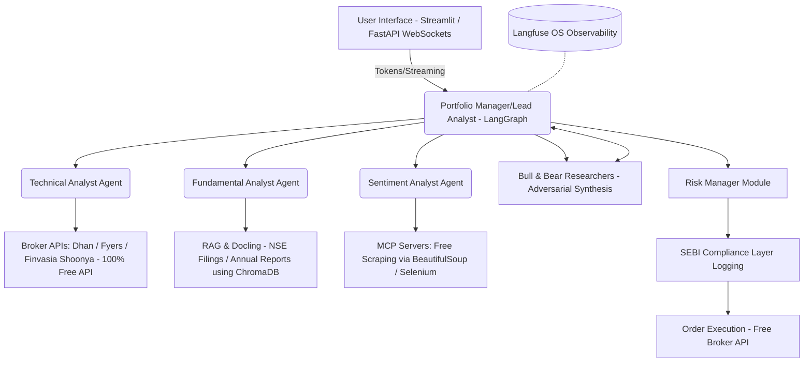
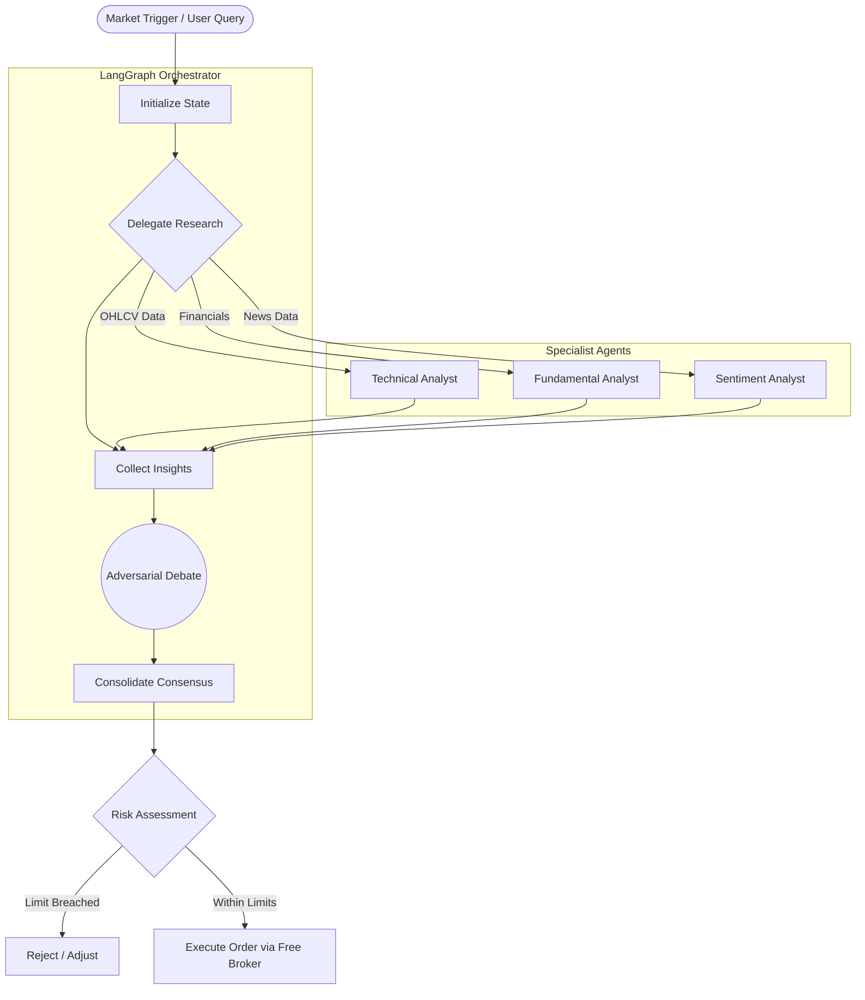

# Implementation Plan: Multi-Factor Trading Analyst (100% Free Tools Architecture)

This document details the development and architecture plan for the agentic Multi-Factor Trading Analyst, designed specifically for the Indian equity market (NSE/BSE), constrained entirely to **free, open-source, or strictly free-tier tools**, based on the provided `summary.md`.

## System Architecture (Free Stack)

The core architecture operates via a hub-and-spoke multi-agent system powered by LangGraph, with Python and FastAPI serving as the backend layer.



## Workflow Diagram

The operational cycle representing stateful tracking and iterative reasoning loops:



## Phase-Wise Development Plan

### Phase 1: Core Framework & Infrastructure (Open Source Base)
- Set up foundational Python backend using asynchronous FastAPI (Open Source).
- Establish the State Management design via Python `TypedDict` or Pydantic models.
- Initialize routing and durable execution (checkpoints) using LangGraph `StateGraph` and local SQLite for persistence.
- Create a minimal viability loop using dummy specialists.

### Phase 2: Data & Connectivity (Free APIs & Scraping)
- Integrate remote MCP servers using `langchain-mcp-adapters` for modular data flow.
- Setup API endpoints connecting to **100% Free Brokerage APIs** (like Dhan, Fyers, or Finvasia Shoonya) avoiding costs from Zerodha/Upstox.
- Connect Sentiment components by building custom Python scrapers (BeautifulSoup/Selenium) for free financial news and MMI approximations.
- Develop Fundamental Data Pipeline using Docling for extracting tables from free NSE PDFs and storing in **ChromaDB** (local, free vector database).

### Phase 3: Specialist Agents & Intelligence (Local & Free-Tier LLMs)
- Develop the **Technical Analyst Agent (TAA)** using `ToolNode` wrappers around open-source TA-Lib scripts.
- Implement the **Fundamental Analyst Agent (FAA)** RAG ingestion pipeline for heavy structured financial documentation parsing.
- Build the **Sentiment Analyst Agent (SAA)** around qualitative extraction.
- Operationalize "Structured Adversarial Synthesis" logic inside the **Bull and Bear Researchers**.

### Phase 4: Risk, Orchestration & Monitoring (Self-Hosted Logging)
- Configure the **Portfolio Manager (Lead Analyst)** logic combining all agent outputs for a final Buy/Hold/Sell signal.
- Build the **Risk Manager** to check portfolio exposure limits, liquidity variables, and volatility bounds.
- Connect the LangGraph trace outputs to **Langfuse** (self-hosted open-source alternative to LangSmith) for observation of token usage and debate logic without SaaS fees.

### Phase 5: SEBI Regulatory Compliance Layer & Broker Execution
- Integrate execution endpoints interfacing directly with the chosen zero-API-cost broker (e.g., Dhan/Shoonya).
- Scaffold mandatory compliance systems:
  - Generation of unique "Algo IDs" mapped to distinct order trails.
  - Setup immutable audit trails stored in local SQLite/PostgreSQL database aligning agent logic to trades.
  - Implement static IP restrictions (via Oracle Always Free), mandatory 2FA, and an emergency broker kill-switch.
  - Structure generated audit trails to support registration as a Research Analyst (RA) for proprietary "Black Box" AI logic.

### Phase 6: Application UI Layer (Streamlit/FastAPI)
- Develop an entirely free, open-source frontend using **Streamlit** which pairs well with FastAPI WebSockets for streaming agent thoughts.
- Create dashboard/interface enabling human oversight, streaming tokens for the Bull/Bear conversations, and real-time execution states.

## Phase-Wise Directory Structure

To maintain modularity as the project scales across the 6 phases, the directory structure should evolve systematically.

### Phase 1: Core Framework & Infrastructure Setup

```text
trade_today/Phase_1/
│
├── core/
│   ├── config.py           # Environment variables, Free API keys, DB URIs
│   ├── state.py            # LangGraph state definitions (TypedDict/Pydantic)
│   ├── orchestrator.py     # Main Portfolio Manager LangGraph workflow
│   └── logger.py           # Base logging setup (preparing for Langfuse)
│
├── api/
│   └── routes.py           # Initial FastAPI endpoints to trigger agents
│
├── app.py                  # FastAPI application entry point
├── requirements.txt
└── .env                    # Hidden local secrets
```

### Phase 2: Data & Connectivity (Free Tools Expansion)

```text
trade_today/Phase_2/
│
├── data_connectors/
│   ├── mcp_servers/        # Configuration for external MCP adapters
│   ├── broker_api.py       # Open/Free API bindings (Dhan/Shoonya)
│   ├── news_scraper.py     # BeautifulSoup scrapers for free sentiment data
│   └── rag_pipeline/       
│       ├── chroma_db/      # Local vector storage for NSE docs
│       └── ingest.py       # Docling PDF extraction logic
```

### Phase 3: Specialist Agents Implementation

```text
trade_today/Phase_3/
│
├── agents/                 # Specialist Graph Nodes
│   ├── technical/          
│   │   └── ta_agent.py     # Wraps TA-Lib tool nodes
│   ├── fundamental/
│   │   └── fa_agent.py     # Queries local ChromaDB via Gemini Flash
│   ├── sentiment/
│   │   └── sentiment_agent.py
│   └── debate/
│       ├── bull_agent.py
│       └── bear_agent.py
```

### Phase 4: Risk, Orchestration & Observability

```text
trade_today/Phase_4/
│
├── core/
│   ├── risk_manager.py     # Exposure calculation and constraints
│   └── langfuse_config.py  # Self-hosted Langfuse API hooks
│
└── tests/
    └── test_orchestrator.py # Local evaluations of Graph output
```

### Phase 5: SEBI Compliance & Execution

```text
trade_today/Phase_5/
│
├── compliance/
│   ├── audit_logger.py     # Local SQLite/Postgres audit trail writer
│   └── algo_id_gen.py      # SEBI-compliant hashing/ID generation
│
└── execution/
    └── order_manager.py    # Formatting final signals to Broker API requests
```

### Phase 6: WebSockets & Streamlit UI

```text
trade_today/Phase_6/
│
├── frontend/
│   ├── streamlit_app.py    # Main UI entry point
│   ├── components/         # Reusable Streamlit widgets (Charts, Debate logs)
│   └── ws_client.py        # Streamlit-to-FastAPI WebSocket listener
│
└── api/
    └── websockets.py       # FastAPI streaming token emitter
```

## Relevant LLMs to Integrate (Zero-Cost / Open Weights)

- **Foundation Models / Core Reasoners**
  - **Node mapping**: Portfolio Manager, Bull/Bear Researchers, Sentiment Analyst.
  - **Tool:** **Llama 3 (70B/8B)** or **Mixtral 8x7B** operating via **Groq's Free Tier** (for blazing fast inference) or via **Together AI free credits**, or locally hosted using **Ollama** if hardware permits.
- **RAG / High-Context Processing**
  - **Node mapping**: Fundamental Analyst Agent (FAA) metadata enrichment / RAG.
  - **Tool:** **Google Gemini 1.5 Flash (via Free Tier API)** - Offers robust multi-modal/PDF capabilities and a massive context window for zero cost under volume limits.
- **Embeddings for Vector Database**
  - **Tool:** **HuggingFace`all-MiniLM-L6-v2`** running locally via sentence-transformers (100% free, runs on CPU).

## Deployment Phase (Zero-Cost Hosting Stack)

1. **Networking and Cloud Baseline**: Utilize **Oracle Cloud's "Always Free" Tier** (provides up to 4 ARM Ampere A1 Compute instances with 24GB RAM). Set up Static IPs for mandatory Broker API whitelisting.
2. **Database and Persistence**: Deploy open-source **PostgreSQL** locally on the Free Tier VM for audit trails, and **ChromaDB** for vector storage.
3. **Observability Ecosystem**: Spin up a Dockerized **Langfuse** instance on the Oracle VM for completely free telemetry and logging.
4. **CI/CD Pipeline**: Utilize free tier **GitHub Actions** for behavioral evaluations.
5. **UI Hosting**: The Streamlit frontend and FastAPI backend will run concurrently on the Oracle Cloud VM behind a free reverse proxy like **Nginx** combined with **Cloudflare** (Free Tier) for SSL, DNS, and DDOS protection.
6. **Regulatory Approval Checkpoint**: Gather "Dry-Run" execution logs generated from local PostgreSQL to submit for NSE/SEBI review under the "Research Analyst (RA) for Black Box AI" requirement.
